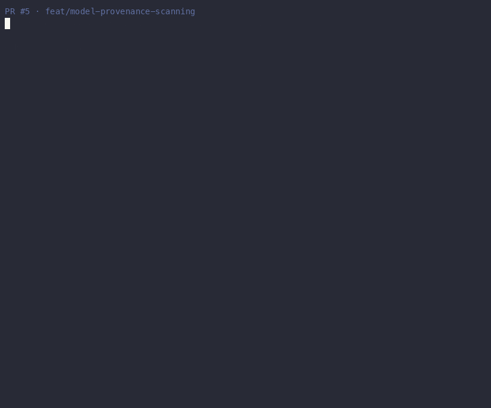

# gh-gemini-review-loop

**Move faster through Gemini Code Assist PR feedback from Claude Code.**

[](https://github.com/OrenAshkenazy/gh-gemini-review-loop/actions/workflows/ci.yml)
[](https://github.com/OrenAshkenazy/gh-gemini-review-loop/releases)
[](LICENSE)

Built for solo builders and small teams who want review feedback handled while they stay in flow. Claude waits for Gemini, reads real GitHub review-thread state, fixes actionable comments, verifies, pushes, and asks Gemini to re-review. It stops at a configurable cap (default: 3 cycles) so it cannot spam your PR.

[Gemini Code Assist](https://github.com/apps/gemini-code-assist) gives you review comments. This plugin turns those comments into an interactive fix loop inside Claude Code: no dashboard hopping, no manual comment triage, no heavy process to adopt.

### Verification Profiles — the loop that checks its own work

The loop doesn't assume its fixes are correct; it verifies them, gating every change on your repository's own tests and linters before it pushes. Setup is a single menu pick; after that it runs silently.

```text
┌───────────────────────────────┬───────────────────────────────────────────────────────────────────────────────────────────┐
│ Zero-touch setup              │ A single menu pick on the first run. No config files and no schema to learn.              │
├───────────────────────────────┼───────────────────────────────────────────────────────────────────────────────────────────┤
│ Repo-aware                    │ Auto-detects repo framework(Python, Node, Rust & Go) for cycle acceptance tests.          │
├───────────────────────────────┼───────────────────────────────────────────────────────────────────────────────────────────┤
│ Regression-proof              │ Every fix is gated on your own tests and linters before it is pushed.                     │
├───────────────────────────────┼───────────────────────────────────────────────────────────────────────────────────────────┤
│ Set once, then silent         │ Returning runs are prompt-free and deterministic.                                         │
├───────────────────────────────┼───────────────────────────────────────────────────────────────────────────────────────────┤
│ Secure by design              │ Pinned commands are saved only on confirmation.                                           │
└───────────────────────────────┴───────────────────────────────────────────────────────────────────────────────────────────┘
```

On the first run in a repository, you choose from a short menu — **All detected · Tests only · Skip · Customize** — and you're set. See [Verification profiles](#verification-profiles) for details.

---

## Prerequisites

- **Claude Code** with plugin support enabled.
- **`gh` CLI** authenticated against the repos you'll run the loop on.
- **Python 3.10+**.
- **A repo where `gemini-code-assist` is configured as a reviewer.** This plugin is opinionated for Gemini Code Assist and does not aggregate other review bots.

## Installation

This repo is a single-plugin Claude Code marketplace. Install in **two slash-commands**.

### Step 1 — Add the marketplace

In your Claude Code prompt:

```
/plugin marketplace add OrenAshkenazy/gh-gemini-review-loop
```

### Step 2 — Install the plugin

```
/plugin install gh-gemini-review-loop@gh-gemini-review-loop
```

That's it. The skill is now available to Claude Code.

To upgrade later (Claude Code uses `/plugin update` for installed plugins, distinct from `/plugin marketplace add` which only manages catalogs):

```
/plugin update gh-gemini-review-loop
```

---

## See It Before You Install



The demo shows a full run in under a minute: the loop activates on a PR with 6 Gemini findings, detects the repo's framework and arms the verification gate (`uv run pytest` — no push unless tests pass), the judge filters out a false positive, fixes land cycle by cycle, and a semantic-risk change pulls the developer in only where needed. It closes with the audit trail — every finding traced to the commit that fixed it — and the aggregated per-repo loop stats (`--stats`): average cycles, time to terminal outcome, findings fixed, false positives avoided.


## Use It

From a repo with an open GitHub PR, say this to Claude:

> Run the Gemini loop

Claude will:

1. Wait for Gemini Code Assist to finish reviewing.
2. Fetch unresolved, actionable Gemini review threads.
3. Ignore stale, resolved, duplicate, or already-addressed threads.
4. Fix clear issues.
5. Run relevant checks.
6. Commit and push to the PR branch.
7. Ask Gemini to re-review.
8. Stop once the PR is clean, a human decision is needed, or the configured re-review cap has been used.

You can also use more specific prompts:

| Say this to Claude | What happens |
|---|---|
| *"Run the Gemini loop"* | Full loop with defaults |
| *"Only fix high-severity Gemini findings"* | Skips lower-severity findings |
| *"Just audit Gemini comments, don't touch anything"* | Read-only inspection |
| *"One cycle only"* | Fixes once, then stops |
| *"Show a live status comment on the PR"* | Maintains one edited status comment on the PR |
| *"Run the Gemini loop with judge eval at completion"* | After the loop stops, OpenAI classifies any remaining Gemini findings as fix / reply / ignore / escalate, so you know whether to keep working or stop |

The skill also triggers naturally when Claude opens a PR and you ask it to keep going, handle review feedback, fix Gemini comments, or request Gemini re-review.

---

## Why This Plugin

Run the full GitHub PR feedback loop with [Gemini Code Assist](https://github.com/apps/gemini-code-assist): wait for Gemini's review, fetch unresolved actionable threads, classify, fix, verify, commit, push, request re-review. Repeat up to the configured cap (default: 3 cycles).

**Why this is safer than a naive Gemini comment scraper:**

- **Thread-state-aware.** Uses GitHub's `reviewThreads` GraphQL (with `isResolved` / `isOutdated`) instead of the flat REST endpoint, so it actually knows what's actionable vs already-handled.
- **`ADDRESSED_BY_REPLY` detection.** Maintainer replied *"wontfix because X"*? The loop honors that — never re-tries the fix and auto-resolves the thread so it stops re-appearing every cycle.
- **Severity-aware ordering + filtering.** Parses Gemini's `critical` / `high` / `medium` / `low` priority markers. Sorts fixes by severity. Filter with `--min-severity high` to skip nits.
- **Configurable cycle cap, counted by the agent.** Only the agent's own re-review pings consume cycles (humans pinging Gemini don't burn cycles). Prevents runaway PR spam — a known failure mode of naive loops.
- **`--dry-run` for every write.** All GraphQL mutations route through one choke point that can log intended writes without executing.
- **Sticky receipt for background visibility.** `--sticky-receipt` posts one comment per PR that gets edited in place as the loop progresses, so PR watchers see live phase status (`RUNNING` → `DONE`) without comment spam.

See [`SKILL.md`](plugins/gh-gemini-review-loop/skills/gh-gemini-review-loop/SKILL.md) for the full workflow definition, stop conditions, and all variation phrasings.

---

## Optional: Per-Finding OpenAI Judge

End users can opt into an OpenAI-powered judge that labels each Gemini finding as `valid_actionable` / `false_positive` / `needs_human` / `explanation_only` / `duplicate` / `already_addressed`, plus a `severity_override` and `recommended_action`. The label appears next to each finding in the loop output.

- **Default: off.** Nothing is sent to OpenAI until you opt in.
- **Privacy boundary:** when enabled, finding bodies and diff hunks are sent to the OpenAI API. The judge is read-only. It never resolves threads, posts comments, or pushes.
- **Cost:** `gpt-4o-mini` is about $0.001 per finding. A typical `on_complete` run is about $0.005 per PR.
- **Discoverability:** on your first loop with findings, the agent shows a one-time tip: `[loop] Tip: judge eval can give a second opinion on these findings.`
- **Natural language:** say "run the Gemini loop with judge eval at completion" or "with judge eval on every cycle". Preference is saved automatically.
- **Explicit setup:** say "enable judge eval" to get a mode prompt with all options.
- **Requires:** an OpenAI API key, resolved from one of [several sources](#setting-your-openai_api_key). No SDK install needed — the judge uses stdlib `urllib`, so any working Python 3.10+ is enough. Missing key → judge skips gracefully and the loop continues unchanged.

### Judge eval TL;DR

1. Set `OPENAI_API_KEY` once (see [Setting your API key](#setting-your-openai_api_key) below).
2. Say one of these to Claude:

   > *"Enable judge eval"* — Claude prompts you to pick a mode and saves it.
   >
   > *"Run the Gemini loop with judge eval at completion"* — saves and runs in one step.

That's it. Claude handles the config file.

### Configuring it yourself

Prefer editing a config file over talking to Claude? Edit (or create) `~/.config/gh-gemini-review-loop/preferences.json`:

```json
{
  "judge_mode": "on_complete",
  "judge_model": "gpt-4o-mini",
  "max_rereview_requests": 3
}
```

| `judge_mode` value | When the judge runs |
|---|---|
| `off` (default) | Never. Nothing is sent to OpenAI |
| `on_complete` | Once, after the loop finishes — cheapest signal |
| `on_cycle` | Every fix cycle — more frequent, ~3× the cost |

Set `max_rereview_requests` to change the persistent loop cap. The CLI flag `--max-rereview-requests` still wins for a single manual invocation.

**To reset:** delete the file. Next run uses `judge_mode: off` and `max_rereview_requests: 3`.

### Setting your `OPENAI_API_KEY`

The judge resolves the key from the first available source, in this order:

1. **`OPENAI_API_KEY` env var** — CI, power users, Claude Code `settings.json` `env` block.
2. **Dotfile** at `~/.config/gh-gemini-review-loop/.env` (chmod 600) — `OPENAI_API_KEY="sk-..."`.
3. **macOS Keychain** (`gh-gemini-review-loop` / `openai`).
4. **Linux Secret Service** (`secret-tool`, GNOME Keyring / KWallet).

**Recommended one-liner** — stores the key in the OS keystore (Keychain on macOS, Secret Service on Linux) or chmod-600 dotfile elsewhere. Survives shell reloads, no rc-file edits, no `ps` leakage:

```bash
python3 "$CLAUDE_PLUGIN_ROOT/skills/gh-gemini-review-loop/scripts/key_resolver.py" --set
# Or, non-interactively from a password manager:
op read 'op://Personal/OpenAI/api key' | \
  python3 "$CLAUDE_PLUGIN_ROOT/skills/gh-gemini-review-loop/scripts/key_resolver.py" --set --from-stdin
```

**Inspect / debug:**

```bash
python3 "$CLAUDE_PLUGIN_ROOT/skills/gh-gemini-review-loop/scripts/key_resolver.py" --print-source
# → source: macos_keychain
#   key:    sk-abc...wxyz   (redacted)

python3 "$CLAUDE_PLUGIN_ROOT/skills/gh-gemini-review-loop/scripts/key_resolver.py" --clear
```

**Self-hosted endpoints** (Ollama / LiteLLM / LM Studio / enterprise gateway): also set `OPENAI_BASE_URL` and the judge will POST there instead of `api.openai.com`. Key-shape validation is bypassed automatically.

> **Migrating from earlier versions?** Older releases required `OPENAI_API_KEY` as a shell-exported env var plus `pip install openai`. Both still work, but `key_resolver.py --set` is the new recommended path and the SDK is no longer needed.

### Verify your setup

If judge eval isn't working, run the doctor — it diagnoses every common failure (missing key, placeholder injected by `~/.claude/settings.json`, network unreachable, wrong Python) and prints the exact fix:

```bash
python3 "$CLAUDE_PLUGIN_ROOT/skills/gh-gemini-review-loop/scripts/judge_doctor.py" --probe
```

See [SKILL.md -> Optional Judge Eval](plugins/gh-gemini-review-loop/skills/gh-gemini-review-loop/SKILL.md) for the full flow and verdict schema.

### Verification profiles

The loop can detect a per-repo **verification profile** on first run — the exact
checks to run at the verify step (pytest/ruff, npm scripts, cargo, go test). On
the first cycle with actionable findings, the agent scans the repo for signals
(pyproject.toml, package.json, Cargo.toml, go.mod) and presents a short **preset
menu**: *All detected*, a narrower *Tests only* / *First check only* (multi-check
repos), *Skip — use ad-hoc verification*, and *Customize manually*. Picking a
preset persists it under `profiles["owner/repo"]` in
`~/.config/gh-gemini-review-loop/preferences.json`; later runs skip the prompt and
run the saved checks. In v1 every saved check is a required gate — failure flips
the verify step to `--verification failed`. **Skip is remembered**: it suppresses
the automatic prompt and stays on ad-hoc checks, but saying *"set up a
verification profile for this repo"* re-runs detection and overrides it.

Example profile entry in `preferences.json`:

```json
{
  "profiles": {
    "owner/repo": {
      "detected_stack": "python",
      "source": "confirmed",
      "working_directory": ".",
      "timeout_seconds": 300,
      "checks": [
        {"name": "tests", "command": "pytest", "required": true},
        {"name": "lint", "command": "ruff check .", "required": true},
        {"name": "typecheck", "command": "mypy .", "required": true}
      ]
    }
  }
}
```

### Run metrics & local stats

Every completed loop run prints a one-screen receipt and appends a local record. Just ask:

> *"Show Gemini loop stats for this repo"*

(or run `--stats` directly) to aggregate those records per repo.

**Per-run receipt** (printed at loop end via `--record-run`, and per cycle via `--cycle-summary`). A small always-on core plus lines that appear only when they carry signal:

```
[loop] Summary
Findings fetched: 7
Fixed: 4
Remaining actionable: 0
Needs human: 1
Cycles used: 2/3
Verification: passed
Outcome: clean
Time to clean PR: 12m
```

**Aggregated stats** — *"Show Gemini loop stats for this repo"* / `--stats`:

```
Gemini loop stats — OrenAshkenazy/gh-gemini-review-loop
Last 10 runs

Average cycles used: 1.8
Average elapsed time to terminal outcome: 9m
Average elapsed time to clean PR: 7m
Average elapsed time to capped run: 31m
Average elapsed time to failed run: 4m
Average active cycle time: 3m
Average active time per run: 6m
Average cycles per run: 1.5
Findings fixed: 32 of 41
Human decisions needed: 6
Addressed by reply: 9
False positives avoided: 14   (across 6 of 10 judged runs)
Most common provider: gemini-code-assist
Most repeated finding area: tests
```

Two kinds of time are reported separately:

- **Elapsed** — user-visible wall-clock latency (includes review-bot waits, polling, and idle time), split by terminal outcome (clean / capped / failed).
- **Active** — agent/loop processing time only, excluding waits.

Metrics are local-only (`~/.config/gh-gemini-review-loop/runs.jsonl`), contain no identity (repo and PR number only), and are never transmitted. Judge-derived and conditional lines (e.g. "False positives avoided", "Addressed by reply", the active-cycle lines) appear only when that data exists for the runs in range.

---

## Configuring the skill

Claude Code skills don't have a settings UI. Persistent script settings live in `~/.config/gh-gemini-review-loop/preferences.json`.

### Set the loop cap

The default cap is `3` re-review requests per PR. The script reads `max_rereview_requests` from `~/.config/gh-gemini-review-loop/preferences.json` on every invocation. To make the loop stop after 4 re-review requests by default, create or edit that file:

```bash
mkdir -p ~/.config/gh-gemini-review-loop
python3 - <<'PY'
import json
from pathlib import Path

path = Path.home() / ".config" / "gh-gemini-review-loop" / "preferences.json"
prefs = json.loads(path.read_text()) if path.exists() else {}
prefs["schema_version"] = 1
prefs["max_rereview_requests"] = 4
path.write_text(json.dumps(prefs, indent=2, sort_keys=True) + "\n")
PY
```

The file should contain this key:

```json
{
  "schema_version": 1,
  "max_rereview_requests": 4
}
```

You can keep judge eval settings in the same file. The script preserves `max_rereview_requests` when saving judge settings.

For one run only, use the CLI flag instead:

```bash
python3 "$SCRIPT" --max-rereview-requests 4
```

Override precedence, highest first:

1. **Direct CLI flags** when invoking the script manually. See `--help` for the full list. CLI flags override the preferences file.
2. **Natural-language prompts.** Say what you want; the agent picks the right script flags from [SKILL.md's Variations table](plugins/gh-gemini-review-loop/skills/gh-gemini-review-loop/SKILL.md). This is the idiomatic path.
3. **`CLAUDE.md` preferences** for persistent per-user or per-repo defaults:
   ```markdown
   ## gh-gemini-review-loop preferences
   - Always pass --min-severity medium (we don't care about Gemini's low nits).
   - Always pass --post-receipt so we get an audit trail on every PR.
   - Use --max-rereview-requests 4 for the API repo (we want one extra cycle).
   ```
4. **Preferences file** for persistent script-level defaults. This is the recommended place for the cap:
   ```json
   {
     "max_rereview_requests": 4
   }
   ```

For the optional OpenAI judge, see [Judge eval TL;DR](#judge-eval-tldr). It shares the same prefs file at `~/.config/gh-gemini-review-loop/preferences.json`.

---

## Advanced: Manual Script Invocation

You'll rarely need this, the skill drives the script for you, but it works for debugging.

`$CLAUDE_PLUGIN_ROOT` is set **only inside Claude Code's plugin runtime** — it isn't exported to your interactive shell, so the variable-form below only works from a Claude session (e.g., a Bash tool call). To run from a plain terminal, locate the cached script path yourself:

```bash
# From a plain terminal — find the installed path (handles version bumps):
SCRIPT=$(find ~/.claude/plugins/cache/gh-gemini-review-loop -name fetch_gemini_threads.py 2>/dev/null | sort | tail -1)
[ -n "$SCRIPT" ] && python3 "$SCRIPT" --wait || echo "Error: fetch_gemini_threads.py not found — install the plugin first." >&2

# From inside a Claude Code session (the env var IS populated there):
python3 "$CLAUDE_PLUGIN_ROOT/skills/gh-gemini-review-loop/scripts/fetch_gemini_threads.py" --wait

# Notable flags:
python3 "$SCRIPT" --dry-run                     # log writes without executing
python3 "$SCRIPT" --post-receipt                # one-shot audit comment
python3 "$SCRIPT" --sticky-receipt              # live, edited-in-place comment
python3 "$SCRIPT" --min-severity high           # ignore Gemini's low/medium nits
python3 "$SCRIPT" --drop-unknown-severity       # also ignore unmarked findings
python3 "$SCRIPT" --no-resolve-outdated         # read-only inspection mode
python3 "$SCRIPT" --include-resolved --include-outdated --include-addressed-by-reply   # full history
python3 "$SCRIPT" --max-rereview-requests 4     # override the configured cap once
python3 "$SCRIPT" --agent-login NAME            # override gh-detected agent login
python3 "$SCRIPT" --author google-gemini-code-assist   # alternate bot login
```

Run `python3 "$SCRIPT" --help` for the complete list.

---

## How It Works

The script queries GitHub's `pullRequest.reviewThreads` via GraphQL, filters to threads authored by `gemini-code-assist`, partitions them into four states (`RESOLVED` / `OUTDATED` / `ADDRESSED_BY_REPLY` / `UNRESOLVED`), and surfaces only the actionable subset. The agent fixes those, commits, pushes, then posts `@gemini-code-assist please review the latest changes.` once per cycle — counted strictly against the agent's own GitHub login so humans can ping Gemini freely. After the configured cap is reached, hard stop. See the [Stopping Conditions](plugins/gh-gemini-review-loop/skills/gh-gemini-review-loop/SKILL.md#stopping-conditions) section in SKILL.md for the full state machine.

---

## License

MIT. See [LICENSE](LICENSE).

---

## What I Want Feedback On

- **Install friction:** where the Claude Code marketplace flow, `gh` auth, or Python dependency expectations feel unclear.
- **False positives:** whether Gemini findings that survive filtering are usually worth acting on.
- **Thread state handling:** whether `RESOLVED`, `OUTDATED`, `ADDRESSED_BY_REPLY`, and `UNRESOLVED` match how maintainers think about review comments.
- **Safety around resolving outdated threads:** whether auto-resolving stale Gemini threads is acceptable by default, or should be more conservative.
- **Whether judge eval is worth adding:** whether the optional OpenAI judge helps enough to justify the setup, privacy boundary, and small API cost.

---

## Contributing

PRs welcome. See [CONTRIBUTING.md](CONTRIBUTING.md) for the `release:*` label convention and the auto-release flow.
