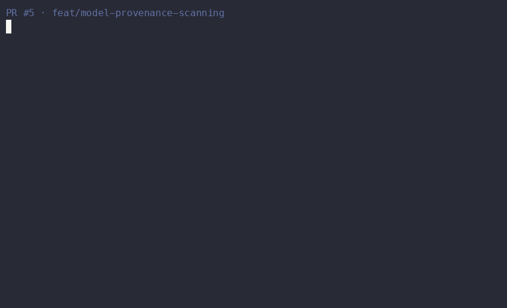

# gh-review-loop

**Your AI reviewer flagged two instances of a bug. There are five. This fixes all five, runs your tests, and stops after three rounds.**

[](https://github.com/OrenAshkenazy/gh-review-loop/actions/workflows/ci.yml)
[](https://github.com/OrenAshkenazy/gh-review-loop/releases)
[](LICENSE)



A skill for **Claude Code** and **Codex** that clears AI reviewer feedback on your PR without you leaving the terminal. It reads real GitHub review-thread state, fixes what's actionable, **sweeps the sibling instances the reviewer didn't flag**, gates every push on your repo's own tests, and asks for re-review — hard-capped so it can't spam the PR.

Works with whatever reviewer bot your repo already has. MIT, no server, no account, no vendor plan.

## Install

**Claude Code** — two slash commands:

```
/plugin marketplace add OrenAshkenazy/gh-review-loop
/plugin install gh-review-loop@gh-review-loop
```

**Codex:**

```bash
codex plugin marketplace add OrenAshkenazy/gh-review-loop
codex plugin add gh-review-loop@gh-review-loop
```

Then, from a repo with an open PR that a reviewer bot has commented on:

> Run the AI reviewer loop

That's the whole interface. [Other install paths](#other-install-paths) · [Prerequisites](#prerequisites)

---

## Why this exists

Bot reviewers expand. You fix the two instances of a pattern it flagged, push, and the next review flags three more in files it hadn't reached yet. Round three finds two more. Each round costs you a context switch, and the bot never tells you it's converging.

Three things in this loop attack that directly:

**It sweeps the class, not the instance.** Findings are clustered by a deterministic pattern signature. When one pattern is flagged at 2+ sites, the agent greps the PR's changed files for the siblings the reviewer *hasn't* flagged yet, reports which extra sites it found and why, then fixes the whole family in one cycle. Blast radius never leaves your own diff. Swept patterns are tracked across cycles, so if one comes back you see `⚠ RECURRED after sweep` instead of silently re-fixing it.

**It won't push red.** Configure a verification profile once — a one-key menu pick on first run, auto-detected from your `pyproject.toml` / `package.json` / `Cargo.toml` / `go.mod` — and every cycle runs your own tests and linters before the commit goes up. A failed required check flips the run to `verification: failed`. Compare: CodeRabbit's autofix runs a build-verification step and [ships the changes anyway when it fails](https://docs.coderabbit.ai/finishing-touches/autofix).

**It has a brake, not a timeout.** The cycle cap is a hard count of re-review requests, default 3, and it counts *only the agent's own pings* — a human asking the bot to look again doesn't burn a cycle. That's a bound on rounds, not a "stop when the bot goes quiet for ten minutes" heuristic.

Everything else it does — reading `isResolved`/`isOutdated` off the `reviewThreads` GraphQL, honoring a maintainer's *"wontfix"* reply, sorting by severity, keeping one live-edited status comment instead of comment spam — is table stakes done carefully. Correct, but not why you'd pick this.

## You probably don't need this if

Being honest about the boundary saves you an install:

- **You use CodeRabbit and pay for Pro.** `@coderabbitai autofix` is on by default and handles CodeRabbit's own threads. What's left is the blocking test gate and the sibling sweep — decide whether those are worth a second tool.
- **You use Copilot code review on a paid plan.** "Fix batch with Copilot" applies multiple Copilot comments at once, and the coding agent validates against your tests before pushing. Same caveat: Copilot's own comments only.
- **You're on Claude Code Review (Team/Enterprise).** It auto-resolves threads when you push a fix, and a `REVIEW.md` with convergence rules solves much of the round-three problem upstream, for free.
- **You want a hosted, zero-config service.** This is a local skill that shells out to `gh`. It does nothing while you aren't running it.

This is for the case where you don't control which bot reviews your repo, you don't want to pay that bot's vendor for its fix feature, and you want a bound on how many rounds this takes.

## What's actually implemented

Checkable claims, with the honest scope of each:

| Capability | Scope | Where |
|---|---|---|
| Thread-state filtering | `reviewThreads` GraphQL, `isResolved` / `isOutdated`, plus `ADDRESSED_BY_REPLY` for maintainer *"wontfix"* replies | `fetch_gemini_threads.py` |
| Pattern clustering + recurrence | Deterministic signature, cross-cycle recurrence tracking. **The sweep itself is an instruction to the agent, not a script** — it greps your changed files under the agent's control | `cluster_findings.py` |
| Verification gate | Auto-detects Python / Node / Rust / Go. Required-check failure flips the run to `verification: failed`. **`Skip` is an offered menu option** — pick it and there is no gate | `detect_profile.py`, `run_profile.py` |
| Cycle cap | Hard count, agent-scoped: only the agent's own pings consume it | `fetch_gemini_threads.py` |
| Severity ordering | Parsed for **Codex (`P0`–`P3`) and Gemini (`critical`–`low`) only.** Other bots' findings are `unknown` and are kept by default | `thread_severity()` |
| Optional judge | Second-model triage per finding (`false_positive`, `needs_human`, …). Off by default, needs an OpenAI key | `judge.py` |
| Audit trail + local stats | One live-edited PR comment, per-run receipts, per-repo aggregates via `--stats`. Never transmitted | `metrics.py` |
| Zero infrastructure | Stdlib Python + `gh` + `git`. No SDK, no server, no account | all scripts |

If you're comparing alternatives, the closest is [pbakaus/agent-reviews](https://github.com/pbakaus/agent-reviews) — broader bot coverage and a nicer CLI, no test gate, no hard round cap, no sibling sweep.

---

## Prerequisites

- **Claude Code or Codex** with plugin support.
- **`gh` CLI**, authenticated against the repos you'll run this on.
- **Python 3.10+** and **git**.
- **A reviewer bot that posts GitHub review threads on your PRs.** Codex (`@codex`) is the bundled default and works out of the box. CodeRabbit, Copilot, Qodo, Sourcery and others work once you give the loop their author login and re-review mention.

> **Note on Gemini Code Assist.** The consumer Gemini Code Assist GitHub app was [deprecated 2026-06-18 and shut down 2026-07-17](https://developers.google.com/gemini-code-assist/docs/deprecations/consumer-code-review). It is no longer the default here. The vendor record is kept for enterprise tenants, which are unaffected — select it explicitly with `--reviewer gemini-code-assist`.

## Supported reviewers

| Reviewer | Support | Re-review trigger | Severity format |
|---|---|---|---|
| Codex (`chatgpt-codex-connector`) | **Built-in default** | `@codex review` | `P0`–`P3`, normalized |
| Gemini Code Assist | Built-in, **enterprise only** ([consumer app shut down](https://developers.google.com/gemini-code-assist/docs/deprecations/consumer-code-review)) | `@gemini-code-assist please review…` | `critical` / `high` / `medium` / `low` |
| CodeRabbit, Copilot, Qodo, Sourcery, … | Configurable | Supplied via `--review-trigger-mention` | **Not parsed** — findings carry `unknown` severity |

`--list-reviewers` discovers which bots have commented on your PR; `--reviewer` persists your choice per PR.

**Severity caveat, stated plainly:** only Codex and Gemini priority markers are parsed today. For any other bot every finding is `unknown`, so `--min-severity high` keeps everything and `--drop-unknown-severity` drops everything. Use severity filtering only with a bot whose format is parsed.

## Other install paths

### Agent Skills (`npx skills`)

```bash
npx skills add OrenAshkenazy/gh-review-loop -a claude-code codex
```

The `-a` flag selects target agents; omit it for the interactive picker. Requires a recent `skills` CLI. If `codex` doesn't appear in the picker, update the installer or use the Codex plugin flow above.

### Upgrading

```
/plugin update gh-review-loop
```

> **Upgrading from `gh-gemini-review-loop`?** Uninstall the old plugin (`/plugin uninstall gh-gemini-review-loop`), re-add the marketplace, install `gh-review-loop@gh-review-loop`. Settings, verification profiles, and run history are untouched — they live in `~/.config/gh-gemini-review-loop/`, which the renamed plugin still reads.

---

## Use it

From a repo with an open GitHub PR:

> Run the AI reviewer loop

The agent will:

1. Wait for the configured reviewer to finish, or ping it first if it only reviews on request.
2. Fetch unresolved, actionable review threads.
3. Skip stale, resolved, duplicate, or already-addressed threads.
4. Cluster findings by pattern and sweep siblings in your changed files.
5. Fix, in severity order.
6. Run your verification profile. Stop here if it fails.
7. Commit and push to the PR branch.
8. Request re-review.
9. Stop when the PR is clean, a human decision is needed, or the cap is used.

More specific phrasings:

| Say this | What happens |
|---|---|
| *"Run the AI reviewer loop"* | Full loop with defaults |
| *"Only fix high-severity reviewer findings"* | Skips lower severities (see the severity caveat above) |
| *"Just audit reviewer comments, don't touch anything"* | Read-only pass |
| *"Show review loop stats for this repo"* | Local aggregates |

See [`SKILL.md`](plugins/gh-review-loop/skills/gh-review-loop/SKILL.md) for the full workflow definition, stop conditions, and every phrasing.

---

## Verification profiles

On the first cycle with actionable findings, the agent scans for build signals (`pyproject.toml`, `package.json`, `Cargo.toml`, `go.mod`) and offers a short preset menu: **All detected · Tests only · Skip · Customize**. Your pick persists under `profiles["owner/repo"]` in `~/.config/gh-gemini-review-loop/preferences.json`; later runs are prompt-free.

Every saved check is a required gate — a failure flips the verify step to `--verification failed`. **`Skip` is remembered** and leaves the loop on ad-hoc verification with no gate; saying *"set up a verification profile for this repo"* re-runs detection and overrides it.

```json
{
  "profiles": {
    "owner/repo": {
      "detected_stack": "python",
      "source": "confirmed",
      "working_directory": ".",
      "timeout_seconds": 300,
      "checks": [
        {"name": "tests", "command": "pytest", "required": true},
        {"name": "lint", "command": "ruff check .", "required": true}
      ]
    }
  }
}
```

## Run metrics and local stats

Ask *"Show review loop stats for this repo"* (or run `--stats`). Metrics are local-only (`~/.config/gh-gemini-review-loop/runs.jsonl`), contain repo and PR number but no identity, and are never transmitted.

**Per-run receipt:**

```
[loop] Summary
Findings fetched: 7
Fixed: 4
Remaining actionable: 0
Needs human: 1
Cycles used: 2/3
Verification: passed
Outcome: clean
Time to clean PR: 12m
```

**Aggregated stats** *(illustrative shape — the numbers below are an example, not measured telemetry)*:

```
Review loop stats — owner/repo
Last 10 runs

Average cycles used: 1.8
Average elapsed time to terminal outcome: 9m
Average active time per run: 6m
Findings fixed: 32 of 41
Human decisions needed: 6
Addressed by reply: 9
False positives avoided: 14   (across 6 of 10 judged runs)
Most repeated finding area: tests
```

**Elapsed** is wall-clock including bot waits; **active** is loop processing time only.

## Optional: per-finding judge

A second model can label each finding (`valid_actionable`, `false_positive`, `needs_human`, `explanation_only`, `duplicate`, `already_addressed`) before you spend a cycle on it. Off by default; needs an OpenAI-compatible key. Calls go out over stdlib `urllib` — no SDK dependency.

```bash
python3 "$GGRL_PLUGIN_ROOT/skills/gh-review-loop/scripts/judge_doctor.py" --probe
```

See [SKILL.md → Optional Judge Eval](plugins/gh-review-loop/skills/gh-review-loop/SKILL.md) for the verdict schema.

## Configuring the skill

Persistent settings live in `~/.config/gh-gemini-review-loop/preferences.json`.

### Set the loop cap

Default is 3 re-review requests per PR:

```bash
python3 - <<'PY'
import json
from pathlib import Path

path = Path.home() / ".config" / "gh-gemini-review-loop" / "preferences.json"
path.parent.mkdir(parents=True, exist_ok=True)
prefs = json.loads(path.read_text()) if path.exists() else {}
prefs["schema_version"] = 2
prefs["max_rereview_requests"] = 4
path.write_text(json.dumps(prefs, indent=2, sort_keys=True) + "\n")
PY
```

Resulting file:

```json
{
  "schema_version": 2,
  "max_rereview_requests": 4
}
```

Judge settings live in the same file; the script preserves `max_rereview_requests` when saving them.

## How it works

The skill drives a set of small stdlib Python scripts under [`plugins/gh-review-loop/skills/gh-review-loop/scripts/`](plugins/gh-review-loop/skills/gh-review-loop/scripts/). Each is independently runnable and `--json`-clean on stdout with progress on stderr, so you can drive the loop by hand or from CI.

Every write to your PR supports `--dry-run`, including the re-review request.

## Feedback wanted

- Which reviewer bot are you on, and does the sibling sweep find real siblings or noise in your codebase?
- Is a cap of 3 the right default, or does your team converge in 2?
- Where does the verification gate get in your way?

Open an [issue](https://github.com/OrenAshkenazy/gh-review-loop/issues) or a [discussion](https://github.com/OrenAshkenazy/gh-review-loop/discussions).

## Contributing

See [CONTRIBUTING.md](CONTRIBUTING.md).

## License

MIT — see [LICENSE](LICENSE).
